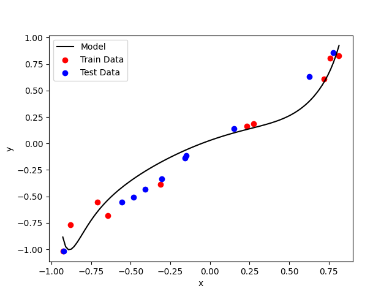

## simplest over_parametrization experiment

多項式モデルのパラメータ数（次数）を$n$, データ数を$N$としたとき、つまり

$$
y= \sum_{i=0}^i w_i x^i, \quad
D = \{(x_i,y_i)\}_{i=1}^N
$$

としたとき、データ数が十分に多い（$N \gg n$）時には上手くいくことが古典的に知られている。

しかし、パラメータ数が極端に多い（$n \gg N$）時にもDeep Learningではうまくいくことが知られている。

これはDeep Learningモデルではないが、（$n \gg N$）のときも、内挿は結構うまくいっていることが確認できる。

画像例


### コメント
重み$w_i$の正則化ロスを加えると上手くいくことも古典的に知られているが、それなしでもうまくいくことが確認できる。

外挿もうまくいくようにするには、多分モデルの初期化の時に妥当なoutput rangeになるように規格化する必要がある気がする。

## 使い方
```
# conf/config.yaml のハイパラを所望のものに書き換えてから、
python main.py

# 学習後の画像の確認はtmp.pngを開いてみる。

# mlflowでの確認は
mlflow ui
```
